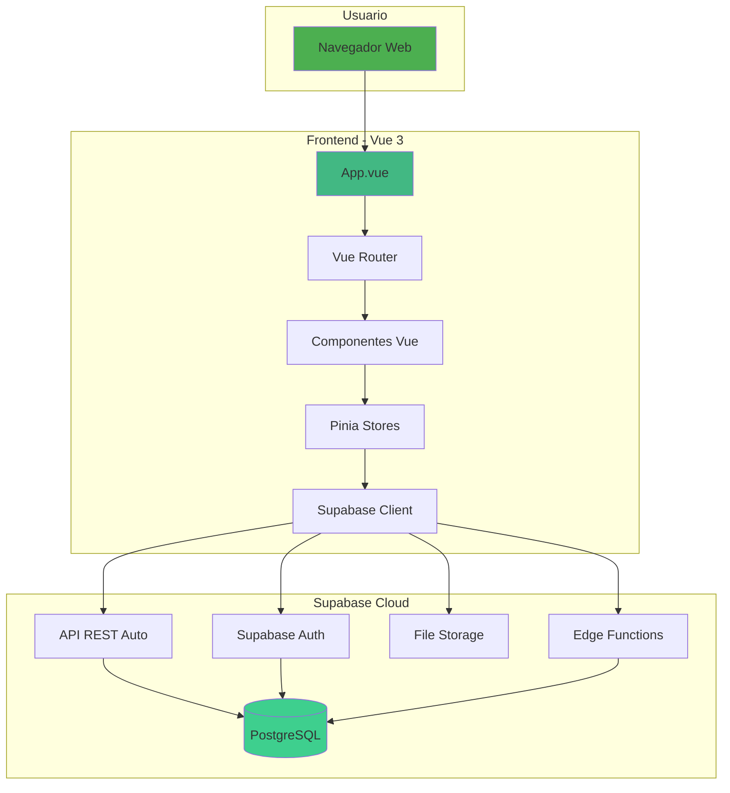
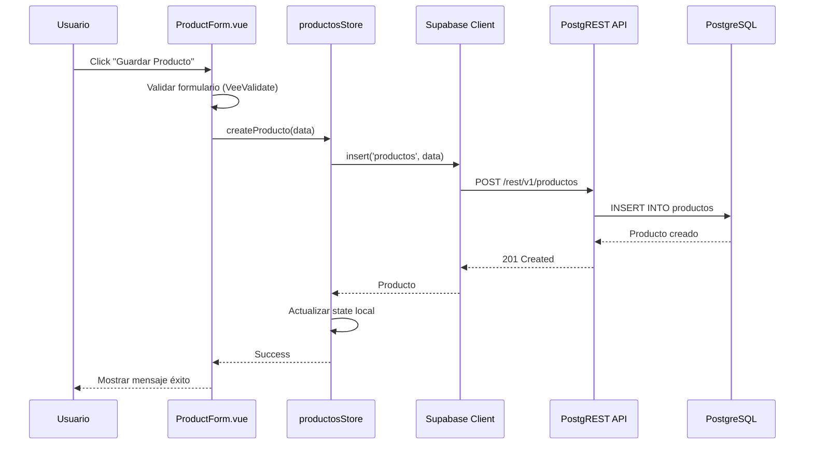

# Arquitectura Vue + Supabase - Bar Gordy

## Visión General

Este documento describe la arquitectura técnica del sistema usando **Vue 3** (frontend) y **Supabase** (backend).

---

## Diagrama de Arquitectura



---

## Flujo de Datos

### Ejemplo: Crear un Producto



---

## Estructura de Carpetas Frontend

```
frontend/
├── public/
│   └── logo.svg
├── src/
│   ├── assets/              # Imágenes, iconos
│   ├── components/
│   │   ├── common/          # Componentes reutilizables
│   │   │   ├── BaseButton.vue
│   │   │   ├── BaseInput.vue
│   │   │   ├── BaseCard.vue
│   │   │   ├── BaseTable.vue
│   │   │   └── BaseModal.vue
│   │   ├── layout/          # Layout principal
│   │   │   ├── AppLayout.vue
│   │   │   ├── AppHeader.vue
│   │   │   └── AppSidebar.vue
│   │   └── modules/         # Componentes por módulo
│   │       ├── dashboard/
│   │       │   └── KPICard.vue
│   │       ├── products/
│   │       │   ├── ProductForm.vue
│   │       │   └── RecipeBuilder.vue
│   │       ├── inventory/
│   │       │   ├── StockEntryForm.vue
│   │       │   ├── StockAdjustmentForm.vue
│   │       │   └── StockHistory.vue
│   │       ├── pos/
│   │       │   ├── ProductSearch.vue
│   │       │   ├── Cart.vue
│   │       │   ├── CartItem.vue
│   │       │   └── PaymentModal.vue
│   │       └── reports/
│   │           ├── SalesReport.vue
│   │           ├── TopProductsReport.vue
│   │           └── MonthlyComparisonReport.vue
│   ├── views/               # Páginas principales
│   │   ├── Dashboard.vue
│   │   ├── Products.vue
│   │   ├── Inventory.vue
│   │   ├── POS.vue
│   │   ├── Reports.vue
│   │   └── Settings.vue
│   ├── stores/              # Pinia stores
│   │   ├── productos.ts
│   │   ├── ventas.ts
│   │   ├── inventario.ts
│   │   └── configuracion.ts
│   ├── router/
│   │   └── index.ts
│   ├── lib/
│   │   └── supabase.ts      # Cliente Supabase
│   ├── types/
│   │   ├── database.types.ts
│   │   └── index.ts
│   ├── utils/
│   │   ├── formatters.ts
│   │   └── pdfGenerator.ts
│   ├── App.vue
│   ├── main.ts
│   └── style.css
├── .env
├── index.html
├── package.json
├── tailwind.config.js
├── postcss.config.js
├── tsconfig.json
└── vite.config.ts
```

---

## Pinia Stores (State Management)

### productosStore

```typescript
// stores/productos.ts
import { defineStore } from 'pinia'
import { supabase } from '@/lib/supabase'
import type { Producto } from '@/types/database.types'

export const useProductosStore = defineStore('productos', {
  state: () => ({
    productos: [] as Producto[],
    categorias: [],
    loading: false,
    error: null as string | null
  }),

  getters: {
    productosSimples: (state) => 
      state.productos.filter(p => p.tipo_producto === 'SIMPLE'),
    
    productosCompuestos: (state) => 
      state.productos.filter(p => p.tipo_producto === 'COMPUESTO'),
    
    productosPorCategoria: (state) => (categoriaId: string) =>
      state.productos.filter(p => p.categoria_id === categoriaId)
  },

  actions: {
    async fetchProductos() {
      this.loading = true
      try {
        const { data, error } = await supabase
          .from('productos')
          .select('*, categoria:categorias(*)')
          .eq('activo', true)
        
        if (error) throw error
        this.productos = data
      } catch (err) {
        this.error = err.message
      } finally {
        this.loading = false
      }
    },

    async createProducto(producto: Partial<Producto>) {
      const { data, error } = await supabase
        .from('productos')
        .insert(producto)
        .select()
        .single()
      
      if (error) throw error
      this.productos.push(data)
      return data
    },

    // ... más acciones
  }
})
```

### ventasStore

```typescript
// stores/ventas.ts
import { defineStore } from 'pinia'
import { supabase } from '@/lib/supabase'
import { useConfiguracionStore } from './configuracion'

interface ItemCarrito {
  productoId: string
  nombre: string
  cantidad: number
  precioUnitario: number
  costo: number
}

export const useVentasStore = defineStore('ventas', {
  state: () => ({
    carrito: [] as ItemCarrito[],
    ventaActual: null
  }),

  getters: {
    subtotal: (state) => 
      state.carrito.reduce((sum, item) => 
        sum + (item.cantidad * item.precioUnitario), 0),
    
    iva(): number {
      const configStore = useConfiguracionStore()
      return this.subtotal * (configStore.porcentajeIVA / 100)
    },
    
    total(): number {
      return this.subtotal + this.iva
    }
  },

  actions: {
    agregarAlCarrito(item: ItemCarrito) {
      const existente = this.carrito.find(i => i.productoId === item.productoId)
      if (existente) {
        existente.cantidad += item.cantidad
      } else {
        this.carrito.push(item)
      }
    },

    async finalizarVenta(metodoPago: string) {
      // 1. Crear venta
      const { data: venta, error: ventaError } = await supabase
        .from('ventas')
        .insert({
          fecha: new Date(),
          subtotal: this.subtotal,
          iva: this.iva,
          total: this.total,
          metodo_pago: metodoPago,
          estado: 'COMPLETADA'
        })
        .select()
        .single()

      if (ventaError) throw ventaError

      // 2. Crear items_venta
      const items = this.carrito.map(item => ({
        venta_id: venta.id,
        producto_id: item.productoId,
        nombre_producto: item.nombre,
        cantidad: item.cantidad,
        precio_unitario: item.precioUnitario,
        subtotal: item.cantidad * item.precioUnitario,
        costo: item.costo
      }))

      const { error: itemsError } = await supabase
        .from('items_venta')
        .insert(items)

      if (itemsError) throw itemsError

      // 3. Stock se actualiza automáticamente via trigger
      
      // 4. Limpiar carrito
      this.carrito = []
      
      return venta
    }
  }
})
```

---

## Esquema de Base de Datos Supabase

### Tablas Principales

#### productos

```sql
CREATE TABLE productos (
  id UUID PRIMARY KEY DEFAULT uuid_generate_v4(),
  nombre TEXT NOT NULL,
  codigo TEXT UNIQUE NOT NULL,
  categoria_id UUID REFERENCES categorias(id),
  descripcion TEXT,
  foto TEXT,
  valor_costo DECIMAL(10,2) NOT NULL,
  valor_venta DECIMAL(10,2) NOT NULL,
  tipo_producto TEXT CHECK (tipo_producto IN ('SIMPLE', 'COMPUESTO')),
  stock_actual INTEGER DEFAULT 0,
  stock_minimo INTEGER DEFAULT 5,
  activo BOOLEAN DEFAULT true,
  created_at TIMESTAMPTZ DEFAULT NOW(),
  updated_at TIMESTAMPTZ DEFAULT NOW()
);

CREATE INDEX idx_productos_codigo ON productos(codigo);
CREATE INDEX idx_productos_categoria ON productos(categoria_id);
```

#### recetas

```sql
CREATE TABLE recetas (
  id UUID PRIMARY KEY DEFAULT uuid_generate_v4(),
  producto_compuesto_id UUID REFERENCES productos(id) ON DELETE CASCADE,
  created_at TIMESTAMPTZ DEFAULT NOW()
);
```

#### componentes_receta

```sql
CREATE TABLE componentes_receta (
  id UUID PRIMARY KEY DEFAULT uuid_generate_v4(),
  receta_id UUID REFERENCES recetas(id) ON DELETE CASCADE,
  producto_simple_id UUID REFERENCES productos(id),
  cantidad DECIMAL(10,2) NOT NULL,
  unidad_medida TEXT DEFAULT 'ml',
  UNIQUE(receta_id, producto_simple_id)
);
```

#### ventas

```sql
CREATE TABLE ventas (
  id UUID PRIMARY KEY DEFAULT uuid_generate_v4(),
  numero SERIAL UNIQUE,
  fecha TIMESTAMPTZ DEFAULT NOW(),
  subtotal DECIMAL(10,2) NOT NULL,
  iva DECIMAL(10,2) NOT NULL,
  total DECIMAL(10,2) NOT NULL,
  metodo_pago TEXT CHECK (metodo_pago IN ('EFECTIVO', 'TARJETA', 'TRANSFERENCIA', 'CREDITO')),
  estado TEXT DEFAULT 'COMPLETADA' CHECK (estado IN ('COMPLETADA', 'CANCELADA')),
  cliente_nombre TEXT,  -- Para crédito
  created_at TIMESTAMPTZ DEFAULT NOW()
);

CREATE INDEX idx_ventas_fecha ON ventas(fecha);
CREATE INDEX idx_ventas_estado ON ventas(estado);
```

---

## Triggers Automáticos (PostgreSQL)

### Trigger: Actualizar Stock al Vender

```sql
-- Función que se ejecuta al insertar items_venta
CREATE OR REPLACE FUNCTION actualizar_stock_venta()
RETURNS TRIGGER AS $$
DECLARE
  v_tipo_producto TEXT;
  v_componente RECORD;
BEGIN
  -- Obtener tipo de producto
  SELECT tipo_producto INTO v_tipo_producto
  FROM productos WHERE id = NEW.producto_id;

  IF v_tipo_producto = 'SIMPLE' THEN
    -- Producto simple: descontar stock directo
    UPDATE productos
    SET stock_actual = stock_actual - NEW.cantidad
    WHERE id = NEW.producto_id;
    
  ELSIF v_tipo_producto = 'COMPUESTO' THEN
    -- Producto compuesto: descontar cada componente
    FOR v_componente IN 
      SELECT cr.producto_simple_id, cr.cantidad
      FROM recetas r
      JOIN componentes_receta cr ON cr.receta_id = r.id
      WHERE r.producto_compuesto_id = NEW.producto_id
    LOOP
      UPDATE productos
      SET stock_actual = stock_actual - (v_componente.cantidad * NEW.cantidad)
      WHERE id = v_componente.producto_simple_id;
    END LOOP;
  END IF;

  RETURN NEW;
END;
$$ LANGUAGE plpgsql;

-- Asociar trigger a tabla items_venta
CREATE TRIGGER trigger_actualizar_stock
AFTER INSERT ON items_venta
FOR EACH ROW
EXECUTE FUNCTION actualizar_stock_venta();
```

---

## Consultas API (Ejemplos)

### Listar Productos con Categoría

```typescript
const { data, error } = await supabase
  .from('productos')
  .select(`
    *,
    categoria:categorias(id, nombre)
  `)
  .eq('activo', true)
  .order('nombre')
```

### Obtener Producto Compuesto con Receta

```typescript
const { data, error } = await supabase
  .from('productos')
  .select(`
    *,
    receta:recetas(
      id,
      componentes:componentes_receta(
        cantidad,
        unidad_medida,
        producto:productos(id, nombre, valor_costo)
      )
    )
  `)
  .eq('id', productoId)
  .single()
```

### Reporte de Ventas del Día

```typescript
const hoy = new Date().toISOString().split('T')[0]

const { data, error } = await supabase
  .from('ventas')
  .select('total, items_venta(cantidad)')
  .gte('fecha', `${hoy}T00:00:00`)
  .lte('fecha', `${hoy}T23:59:59`)
  .eq('estado', 'COMPLETADA')
```

---

## Seguridad (RLS - Row Level Security)

### Configuración Inicial (Sin Auth)

Para MVP sin autenticación, deshabilitamos RLS o permitimos acceso público:

```sql
-- Opción 1: Deshabilitar RLS (desarrollo)
ALTER TABLE productos DISABLE ROW LEVEL SECURITY;
ALTER TABLE ventas DISABLE ROW LEVEL SECURITY;
-- ... etc para todas las tablas

-- Opción 2: Permitir acceso público (producción sin auth)
ALTER TABLE productos ENABLE ROW LEVEL SECURITY;

CREATE POLICY "Permitir lectura pública" ON productos
FOR SELECT USING (true);

CREATE POLICY "Permitir escritura pública" ON productos
FOR INSERT WITH CHECK (true);

-- Similar para otras tablas
```

### Configuración Futura (Con Auth)

Cuando se agregue autenticación de usuarios:

```sql
-- Solo usuarios autenticados pueden modificar
CREATE POLICY "Solo autenticados pueden escribir" ON productos
FOR ALL USING (auth.role() = 'authenticated');
```

---

## Ventajas de Esta Arquitectura

### 1. Sin Backend Personalizado
- ✅ No hay servidor Node.js que configurar
- ✅ No hay endpoints que escribir manualmente
- ✅ API REST generada automáticamente desde esquema

### 2. PostgreSQL Real
- ✅ Relaciones complejas (productos → recetas → componentes)
- ✅ Triggers para lógica automática (actualizar stock)
- ✅ Funciones SQL para cálculos complejos
- ✅ Transacciones ACID

### 3. Escalabilidad Simple
- ✅ Plan gratuito: hasta 500MB DB
- ✅ Upgrade a $25/mes: 8GB DB, backups automáticos
- ✅ Sin cambios en código al escalar

### 4. Developer Experience
- ✅ Dashboard visual de Supabase para ver datos
- ✅ Migraciones con Supabase CLI
- ✅ Auto-completado TypeScript con tipos generados

---

## Limitaciones y Consideraciones

### Tier Gratuito

| Recurso | Límite Free | Suficiente Para |
|---------|-------------|-----------------|
| Database | 500 MB | ~100,000 ventas |
| Bandwidth | 1 GB/mes | ~5,000 usuarios/mes |
| Storage | 2 GB | ~500 fotos productos |

### Cuándo Upgrade

Considera upgrade a Pro ($25/mes) cuando:
- Base de datos > 400MB
- Más de 3,000 usuarios activos/mes
- Necesitas backups automáticos diarios
- Requieres soporte prioritario

---

## Próximos Pasos

1. ✅ Usuario crea proyecto Supabase
2. ⏳ Ejecutar script SQL para crear tablas
3. ⏳ Inicializar proyecto Vue
4. ⏳ Configurar `.env` con credenciales Supabase
5. ⏳ Crear componentes base
6. ⏳ Implementar módulos uno por uno
