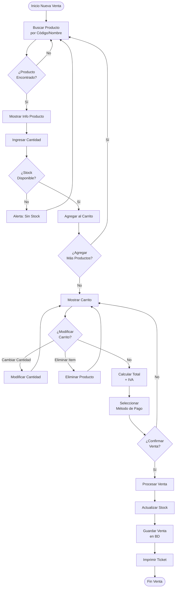
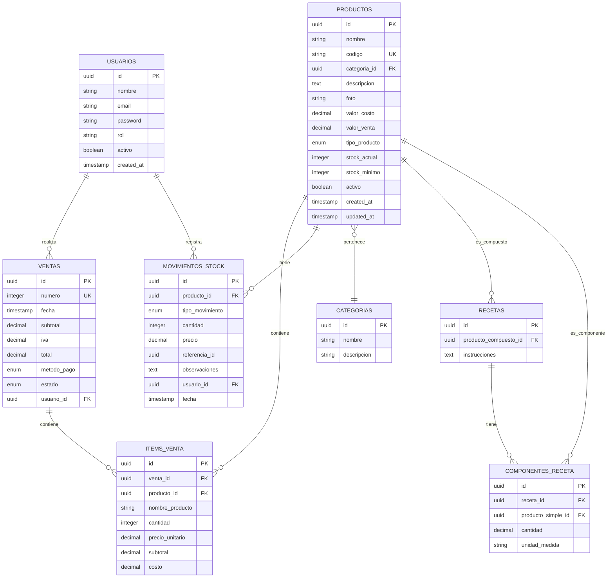
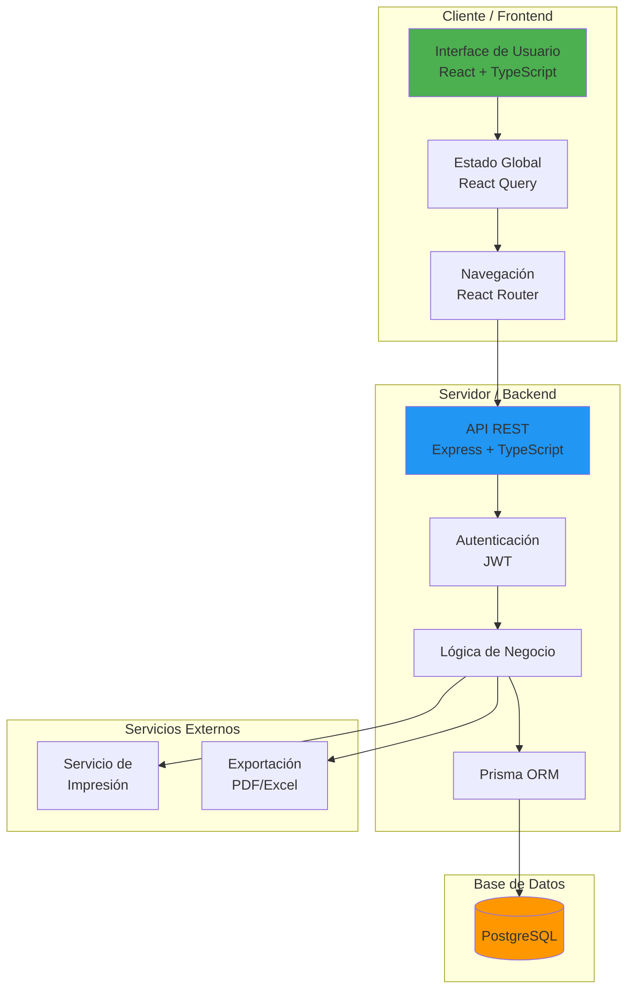
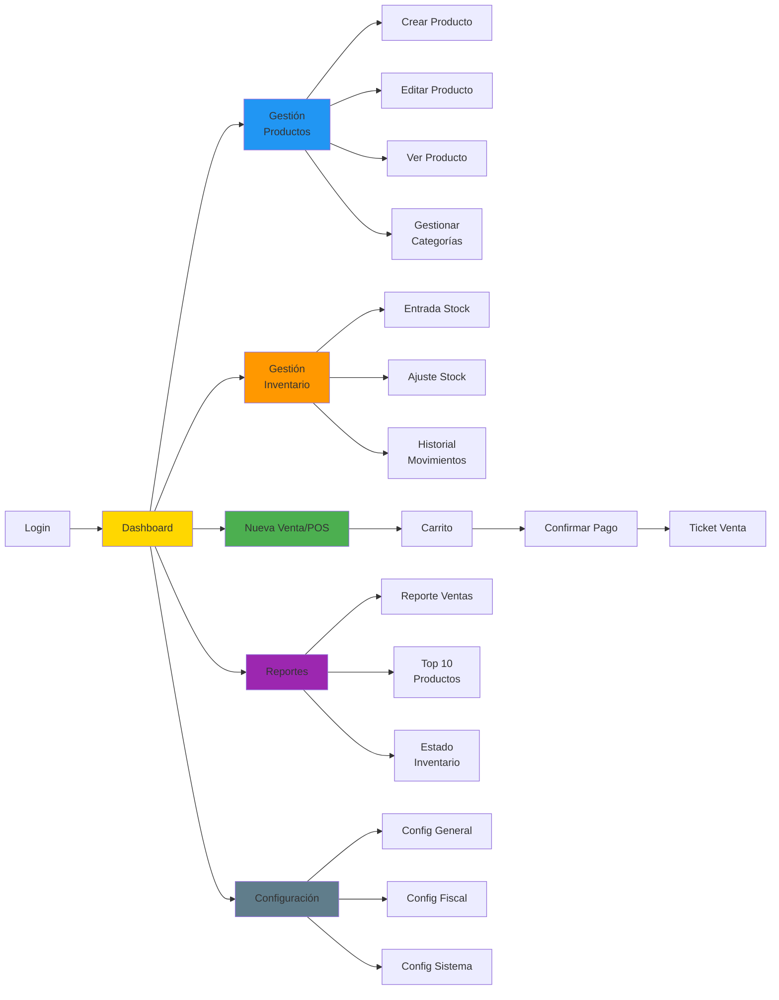
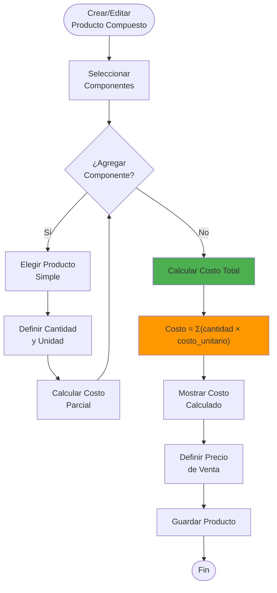
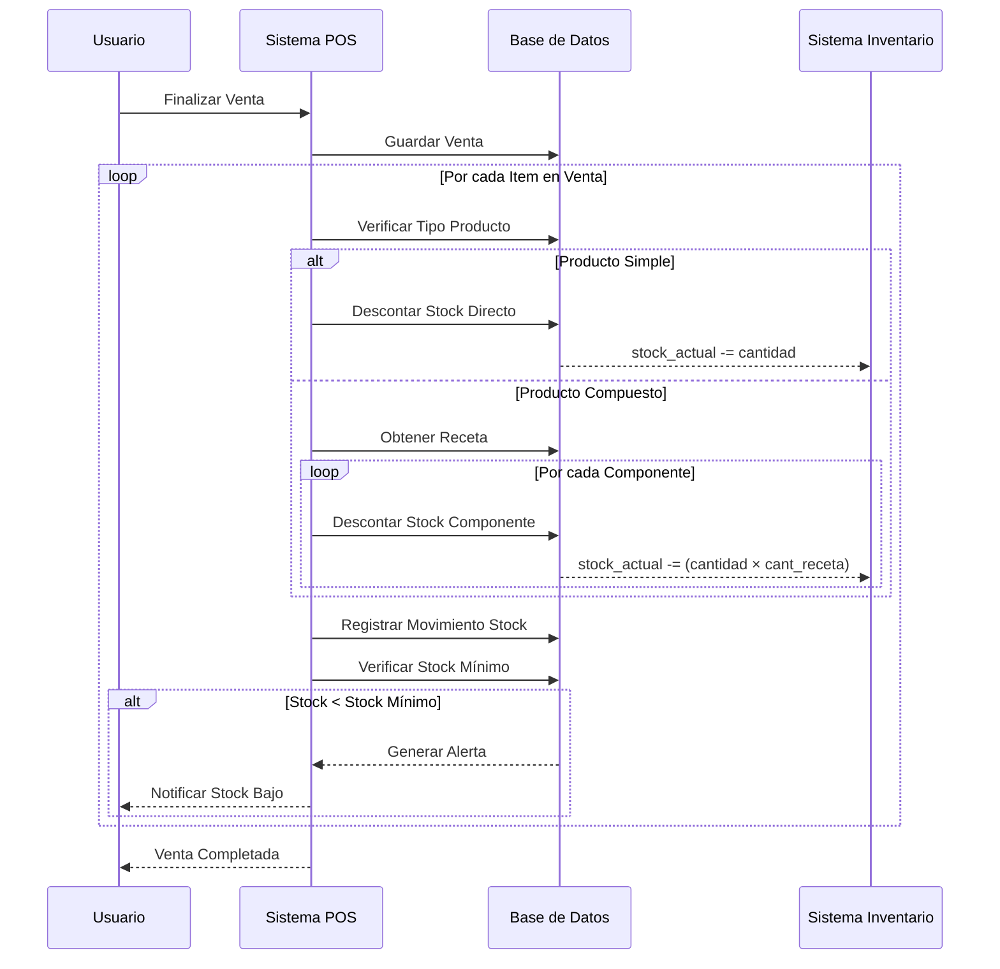

# Diagramas del Sistema - Bar Gordy

## 1. Diagrama de Flujo de Venta (POS)



---

## 2. Diagrama de Modelo de Datos (ERD)



---

## 3. Diagrama de Arquitectura del Sistema



---

## 4. Diagrama de Navegación del Sistema



---

## 5. Flujo de Cálculo de Costo para Producto Compuesto



---

## 6. Flujo de Actualización de Stock



---

## 7. Estructura de Carpetas del Proyecto

```
bar-gordy/
├── backend/
│   ├── src/
│   │   ├── config/          # Configuración (DB, env)
│   │   ├── controllers/     # Controladores de rutas
│   │   ├── middlewares/     # Auth, validación
│   │   ├── models/          # Modelos de datos
│   │   ├── routes/          # Definición de rutas
│   │   ├── services/        # Lógica de negocio
│   │   ├── utils/           # Utilidades
│   │   └── index.ts         # Entry point
│   ├── prisma/
│   │   └── schema.prisma    # Schema de BD
│   ├── package.json
│   └── tsconfig.json
│
├── frontend/
│   ├── public/
│   ├── src/
│   │   ├── assets/          # Imágenes, iconos
│   │   ├── components/      # Componentes reutilizables
│   │   │   ├── common/      # Botones, inputs, etc.
│   │   │   ├── layout/      # Header, Sidebar
│   │   │   └── modules/     # Componentes por módulo
│   │   ├── pages/           # Páginas/Vistas
│   │   │   ├── Dashboard.tsx
│   │   │   ├── Products.tsx
│   │   │   ├── Inventory.tsx
│   │   │   ├── POS.tsx
│   │   │   ├── Reports.tsx
│   │   │   └── Settings.tsx
│   │   ├── hooks/           # Custom hooks
│   │   ├── services/        # API calls
│   │   ├── store/           # Estado global
│   │   ├── types/           # TypeScript types
│   │   ├── utils/           # Helpers
│   │   ├── App.tsx
│   │   └── main.tsx
│   ├── package.json
│   └── tsconfig.json
│
├── docs/                    # Documentación
│   ├── requerimiento.txt
│   ├── especificacion-tecnica.md
│   └── diagramas.md
│
├── docker-compose.yml       # Docker config
├── .gitignore
└── README.md
```
